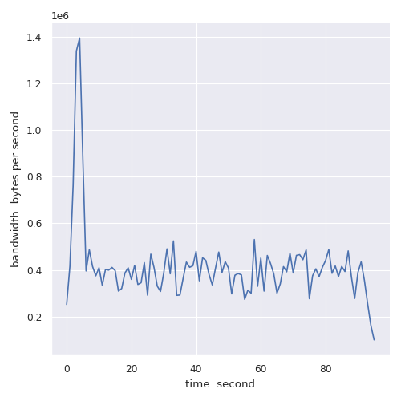

# MP1 Report

---

- Zonglin Peng (zonglin7)
- Huiming Sun (huiming5)

---

The cluster number we are working on is `g03`

[GitHub Link](https://github.com/cs425-ece428/mp1-monad-mp1)
[https://github.com/cs425-ece428/mp1-monad-mp1](https://github.com/cs425-ece428/mp1-monad-mp1)

## Instructions for building and running

[pre-compiled binaries](https://github.com/cs425-ece428/mp1-monad-mp1/releases/tag/1.0.2)
[https://github.com/cs425-ece428/mp1-monad-mp1/releases/tag/1.0.2](https://github.com/cs425-ece428/mp1-monad-mp1/releases/tag/1.0.2)

```bash
# Quick Build
bash ./script/unix/mp1/quick_build.bash
# Release Build
bash ./script/unix/mp1/build.bash
# Usage

# 1 nodes for local test
./bin/mp1 A 8080 ./lib/mp1/config/1/config_a.txt

# 2 nodes for local test
./bin/mp1 A 8080 ./lib/mp1/config/2/config_a.txt
./bin/mp1 B 8081 ./lib/mp1/config/2/config_b.txt

# 3 nodes
./bin/mp1 A 8080 ./lib/mp1/config/config_a.txt
./bin/mp1 B 8081 ./lib/mp1/config/config_b.txt
./bin/mp1 C 8082 ./lib/mp1/config/config_c.txt

# just stdout
python3 -u ./script/unix/mp1/gentx.py 0.5 | ./bin/mp1 A 8080 ./lib/mp1/config/3/config_a.txt 2> /dev/null
python3 -u ./script/unix/mp1/gentx.py 0.5 | ./bin/mp1 B 8081 ./lib/mp1/config/3/config_b.txt 2> /dev/null
python3 -u ./script/unix/mp1/gentx.py 0.5 | ./bin/mp1 C 8082 ./lib/mp1/config/3/config_c.txt 2> /dev/null

# stderr to file
python3 -u ./script/unix/mp1/gentx.py 0.5 | ./bin/mp1 A 8080 ./lib/mp1/config/3/config_a.txt 2> /tmp/a.log
python3 -u ./script/unix/mp1/gentx.py 0.5 | ./bin/mp1 B 8081 ./lib/mp1/config/3/config_b.txt 2> /tmp/b.log
python3 -u ./script/unix/mp1/gentx.py 0.5 | ./bin/mp1 C 8082 ./lib/mp1/config/3/config_c.txt 2> /tmp/c.log

# json log
python3 -u ./script/unix/mp1/gentx.py 0.5 | LOG=json ./bin/mp1 A 8080 ./lib/mp1/config/3/config_a.txt 2> /tmp/a.log
python3 -u ./script/unix/mp1/gentx.py 0.5 | LOG=json ./bin/mp1 B 8081 ./lib/mp1/config/3/config_b.txt 2> /tmp/b.log
python3 -u ./script/unix/mp1/gentx.py 0.5 | LOG=json ./bin/mp1 C 8082 ./lib/mp1/config/3/config_c.txt 2> /tmp/c.log

# trace log
python3 -u ./script/unix/mp1/gentx.py 0.5 | LOG=trace ./bin/mp1 A 8080 ./lib/mp1/config/3/config_a.txt 2> /tmp/a.log
python3 -u ./script/unix/mp1/gentx.py 0.5 | LOG=trace ./bin/mp1 B 8081 ./lib/mp1/config/3/config_b.txt 2> /tmp/b.log
python3 -u ./script/unix/mp1/gentx.py 0.5 | LOG=trace ./bin/mp1 C 8082 ./lib/mp1/config/3/config_c.txt 2> /tmp/c.log

# 8 nodes
python3 -u ./script/unix/mp1/gentx.py 5 | LOG=json ./bin/mp1 node1 8080 ./lib/mp1/config/8/config_1.txt 2> /tmp/1.log
python3 -u ./script/unix/mp1/gentx.py 5 | LOG=json ./bin/mp1 node2 8081 ./lib/mp1/config/8/config_2.txt 2> /tmp/2.log
python3 -u ./script/unix/mp1/gentx.py 5 | LOG=json ./bin/mp1 node3 8082 ./lib/mp1/config/8/config_3.txt 2> /tmp/3.log
python3 -u ./script/unix/mp1/gentx.py 5 | LOG=json ./bin/mp1 node4 8083 ./lib/mp1/config/8/config_4.txt 2> /tmp/4.log
python3 -u ./script/unix/mp1/gentx.py 5 | LOG=json ./bin/mp1 node5 8084 ./lib/mp1/config/8/config_5.txt 2> /tmp/5.log
python3 -u ./script/unix/mp1/gentx.py 5 | LOG=json ./bin/mp1 node6 8085 ./lib/mp1/config/8/config_6.txt 2> /tmp/6.log
python3 -u ./script/unix/mp1/gentx.py 5 | LOG=json ./bin/mp1 node7 8086 ./lib/mp1/config/8/config_7.txt 2> /tmp/7.log
python3 -u ./script/unix/mp1/gentx.py 5 | LOG=json ./bin/mp1 node8 8087 ./lib/mp1/config/8/config_8.txt 2> /tmp/8.log

# enable metrics

python3 -u ./script/unix/mp1/gentx.py 50 | METRICS=y ./bin/mp1 C 8082 ./lib/mp1/config/3/config_c.txt
python3 -u ./script/unix/mp1/gentx.py 50 | METRICS=y ./bin/mp1 B 8081 ./lib/mp1/config/3/config_b.txt
python3 -u ./script/unix/mp1/gentx.py 50 | METRICS=y ./bin/mp1 A 8080 ./lib/mp1/config/3/config_a.txt
```

### Verbose Mode

```bash
LOG=trace
```

### JSON Mode

```bash
LOG=json
```

### Command Line Arguments

Each node must take three arguments. The first argument is an identifier that is unique for each node. The second argument is the port number it listens on. The third argument is a configuration file – the first line of the configuration file is the number of other nodes in the system that it must connect to, and each subsequent line contains the identifier, hostname, and the port no. of these nodes. Note the configuration file provided to each node will be different (as it will exclude the identifier, hostname and port of that node). For example, consider a system of three nodes with identifiers node1, node2 and node3, where a node runs on each of the first 3 VMs in your group (say g01), and each node uses port no. 1234. The configuration file provided to node1 should look like this:

```txt
2
node2 fa21-cs425-g01-02.cs.illinois.edu 1234
node3 fa21-cs425-g01-03.cs.illinois.edu 1234
```

The configuration file for the second node will look like this:

```txt
2
node1 fa21-cs425-g01-01.cs.illinois.edu 1234
node3 fa21-cs425-g01-03.cs.illinois.edu 1234
```

And so on. We will use our own configuration files when testing the code, so make sure your configuration file complies with this format.

Each node must listen for TCP connections from other nodes, as well as initiate a TCP connection to each of the other nodes. Note that a connection initiation attempt will fail, unless the other node’s listening socket is ready. Your node’s implementation may continuously try to initiate connections until successful. You may assume no node failure occurs during this start-up phase. Further ensure that your implementation appropriately waits for a connection to be successfully established before trying to send on it.

Note: make sure your node can run using the EXACT command given below.

```bash
./mp1_node {node id} {port} {config file}
```

## Design Document

We use a combination of ISIS algorithm and R-Multicast to ensure Reliable Total-Ording. The ISIS algorithm can guarantee Total-Ording, R-Multicast to ensure reliable Multicast.
In addition, we also assume that once a node loses its TCP connection, it will be evicted from the Group (A failed node will not become alive again). There will also have a timeout (6 secs) to reject all message send from a crashed process that still not announce their final seq number.

### Proof of correctness


### ISIS

We follow the instructions in the following pseudo code to implement ISIS.

[ISIS](https://studylib.net/doc/7830646/isis-algorithm-for-total-ordering-of-messages)


### Terminology / System Architecture

#### Node

`lib/mp1/multicast`

Each Node is an independent individual that exists in the Group;
This Node and other Nodes perform full-duplex TCP communication according to the configuration in the configuration file.
Each Node has a unique Node ID in the Group to indicate the identity of the process.

#### Group

`lib/mp1/multicast`

Group is a collection of Node.
Group encapsulates `Unicast`, `B-Multicast`, `R-Multicast` and `TO-Multicast`.

#### Config

`lib/mp1/config`

Parse the configuration file format

#### Router

`lib/mp1/router`

A simple fully match router implementation.

#### Metrics

- Serialization bandwidth and delay struct
- Log bandwidth and latency

#### Transaction

- The logical of the transaction
- Parse transactions raw string
- Register transaction processing function

#### Retry

`lib/retry`

Retry call f every interval until the maximum number of attempts is reached.
If the incoming attempts is 0, retry forever

#### Broker

`lib/broker`

A one to many proxy for channel

## Graphs of the Evaluation

### 3 nodes, 0.5 Hz each, running for 100 seconds

A


B


C


Delay


### 8 nodes, 5 Hz each, running for 100 seconds

node1


node2


node3


node4


node5


node6


node7


node8


Delay


### 3 nodes, 0.5 Hz each, runing for 100 seconds, then one node fails, and the rest continue to run for 100 seconds

A


B


C


Delay


### 8 nodes, 5 Hz each, running for 100 seconds, then 3 nodes fail simultaneously, and the rest continue to run for 100 seconds

node1


node2


node3


node4


node5


node6


node7



node8


Delay

