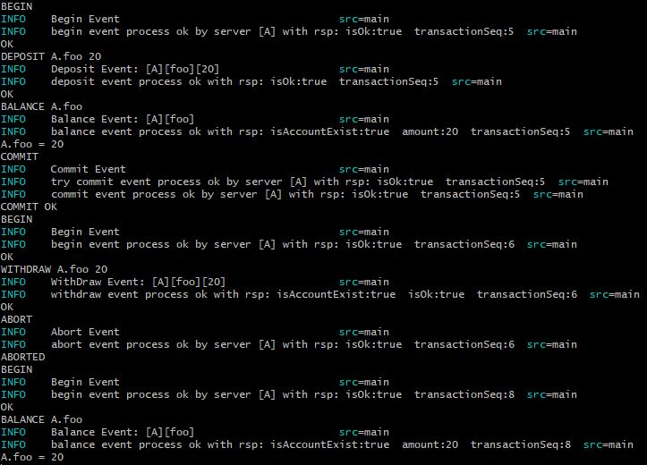
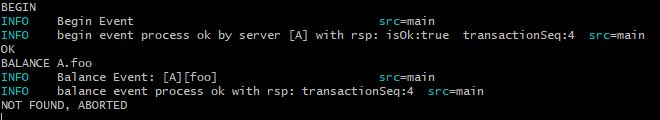
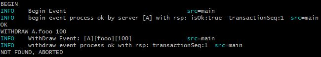
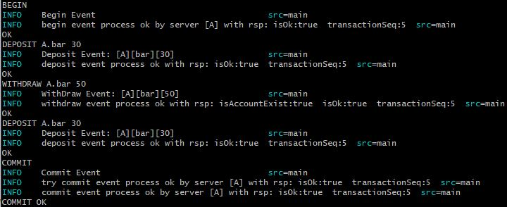
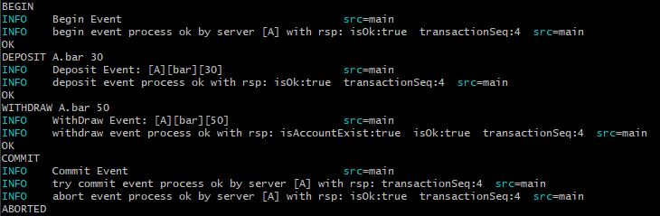
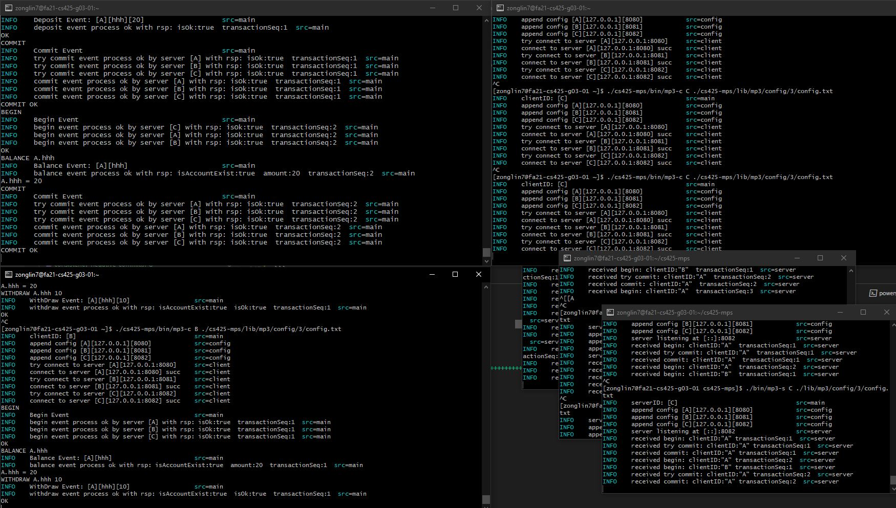
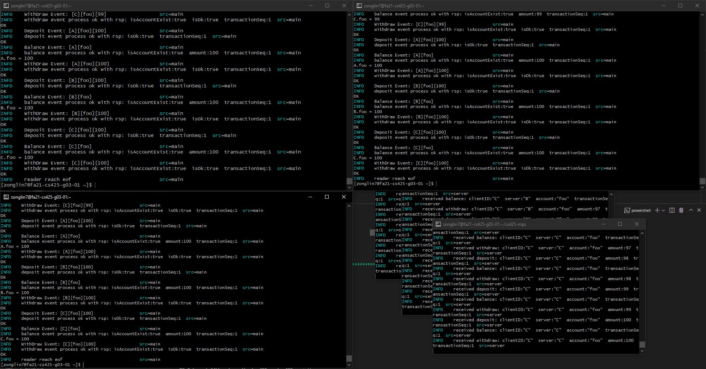

# MP3 Report

---

- Zonglin Peng (zonglin7)
- Huiming Sun (huiming5)

---

The cluster number we are working on is `g03`

[GitHub Link (https://github.com/zonglinpeng/distributed_algorithms-mps)](https://github.com/zonglinpeng/distributed_algorithms-mps)

Commit SHA: `ed875da9dfaf31266efd9c8ad9eb8d90f6294e93`

## Instructions for building and running

[Pre-compiled Binaries (https://github.com/zonglinpeng/distributed_algorithms-mps/releases/tag/mp3-v1.0.0)](https://github.com/zonglinpeng/distributed_algorithms-mps/releases/tag/mp3-v1.0.0)

```bash
# Quick Build
bash ./script/unix/mp3/quick_build.bash
# Release Build
bash ./script/unix/mp3/build.bash
# Build server and client to project root folder for report
bash ./script/unix/mp3/build_report_binary.bash
# Usage
./bin/mp3-c 1 ./lib/mp3/config/1/config.txt
./bin/mp3-s A ./lib/mp3/config/1/config.txt
```

<div style="page-break-after: always;"></div>

### Verbose Mode

```bash
LOG=trace
```

### JSON Mode

```bash
LOG=json
```

### Command Line Arguments

```bash
./bin/mp3-c 1 ./lib/mp3/config/1/config.txt
./bin/mp3-s A ./lib/mp3/config/1/config.txt
```

## Gen RPC

```bash
cd ./lib/mp3/transaction
protoc --go_out=. --go_opt=paths=source_relative \
    --go-grpc_out=. --go-grpc_opt=paths=source_relative \
    transaction.proto
```

<div style="page-break-after: always;"></div>

## Design Document

Our current implementation does not include Deadlock Resolution,
Therefore, this part of the description will not be involved in the design document.

In our implementation, we use Strict two-phase locking as a concurrency control protocol to guarantees serializability.
By the S2PL protocol, locks are applied and removed in two phases:

- Expanding phase: locks are acquired and no locks are released.
- Shrinking phase: locks are released and no locks are acquired. a transaction needs to comply with 2PL, and release its write (exclusive) locks only after it has ended

We use our own reentrant and atomically upgradeable read-write lock to ensure the successful execution of S2PL. A mutex lock is embedded in the structure of the read-write lock to protect the atomicity of lock upgrades.
However, there may be deadlocks in some cases.
Consider the following two concurrent transactions:

> T1: R(A), W(A)

> T2: R(A), W(A)

T1 and T2 both want to upgrade their locks, at this time they have already acquired a read lock,
T1 acquired the mutex lock, but was blocked by T2's read lock when attempting to acquire the write lock after releasing its read lock.
T2 cannot enter the critical section because it cannot acquire the mutex lock of T1.

Briefly, we use the clientID and a transaction serial number that monotonically increments in each clientID to uniquely determine a session.
In this session, we will collect all the requests and write them into the copy of the original Account,
In this copy, the read-write lock of the original Account is still referenced, but there is a completely different balance copy.
After the transaction is committed, the server will release all locks held by the current session. And apply the difference generated by the current transaction to the affected account,
If this transaction is aborted, the server will also release all locks held by the current session.
Once a transaction has been aborted, even if the transaction acquires the lock after that, it will release its lock immediately.
We use a two-phase commit protocol (2PC) to ensure that any server's uncommitted transaction will cause the transaction to roll back on all servers (atomic commitment protocol).
When the client receives the commit command, the client will first send a try commit request to each server.
All servers will check whether the commit will break consistency.
If the client receives all replies successfully,
The client will send a commit request to allow all servers to apply the differences generated by the current transaction to the affected accounts.
And release all related locks.


> the protocol consists of two phases:

> The commit-request phase (or voting phase), in which a coordinator process attempts to prepare all the transaction's participating processes (named participants, cohorts, or workers) to take the necessary steps for either committing or aborting the transaction and to vote, either "Yes": commit (if the transaction participant's local portion execution has ended properly), or "No": abort (if a problem has been detected with the local portion), and

> The commit phase, in which, based on voting of the participants, the coordinator decides whether to commit (only if all have voted "Yes") or abort the transaction (otherwise), and notifies the result to all the participants. The participants then follow with the needed actions (commit or abort) with their local transactional resources (also called recoverable resources; e.g., database data) and their respective portions in the transaction's other output (if applicable).

In order to guarantee the atomic commit of multiple servers in the case of a client crash. Once any server receives the commit command,
The server will r-multicast this command to all servers, so that it could ensure that a transaction is either committed or never committed.

A transaction will not make any changes to the bank object before it is committed. If a transaction is aborted, any operations generated in the session of this transaction will not be merged back to the bank object. This will ensure that other transactions do not use partial results from aborted transactions.

In the following, I introduce in detail each component included in this program and the data structure attached to it.

<div style="page-break-after: always;"></div>

### Terminology / System Architecture

#### Atomic

`lib/mp3/atomic`

Thread-safe implementation of Int64 and Boolean.

AtomicInt64 is used to maintain the monotonic self-increment of the transaction serial number of a single Client.

AtomicBoolean is used to determine whether the current state of the Client is in a transaction.

#### Bank

`lib/mp3/bank`

Bank maintain a final copy of the account on each Server.
Once a transaction is successfully committed.
The final copy of the account on this server will be modified and visible to other transactions.
Bank uses a HashMap to store the relationship between Account Name and AccountInfo.
Each AccountInfo contains an int64 integer representing the current account balance and a reference to a read-write lock.
This read-write lock is a fine-grained lock that can be guaranteed concurrent reads and writes on different entries of the HashMap, and guarantees concurrent reads and mutually exclusive writes on the same Entry of the HashMap. In addition, the Bank also includes a global read-write lock to ensure that the HashMap in the Bank can be atomically updated when the transaction is committed.

<div style="page-break-after: always;"></div>

#### Config

`lib/mp3/config`

Parse the configuration file format.
Config file will be parsed as a list of triples (NodeID, NodeHost, NodePort)

#### Transaction

`lib/mp3/transaction`

Includes client and server methods automatically generated by grpc.
Specific protocol definition

<div style="page-break-after: always;"></div>

```proto
syntax = "proto3";

option go_package = "github.com/zonglinpeng/distributed_algorithms/lib/mp3/transaction";
package transaction;

service Transaction {
  rpc Begin(BeginReq) returns (BeginRes) {}
  rpc Deposit(DepositReq) returns (DepositRes) {}
  rpc Balance(BalanceReq) returns (BalanceRes) {}
  rpc WithDraw(WithDrawReq) returns (WithDrawRes) {}
  rpc TryCommit(TryCommitReq) returns (TryCommitRes) {}
  rpc Commit(CommitReq) returns (CommitRes) {}
  rpc Abort(AbortReq) returns (AbortRes) {}
}

message BeginReq {
  string clientID = 1;
  int64 transactionSeq = 2;
}

message BeginRes {
  bool isOk = 1;
  int64 transactionSeq = 2;
}

message DepositReq {
  string clientID = 1;
  string server = 2;
  string account = 3;
  int64 amount = 4;
  int64 transactionSeq = 5;
}

message DepositRes {
  bool isOk = 1;
  int64 transactionSeq = 2;
}

message BalanceReq {
  string clientID = 1;
  string server = 2;
  string account = 3;
  int64 transactionSeq = 4;
}

message BalanceRes {
  bool isAccountExist = 1;
  int64 amount = 2;
  int64 transactionSeq = 3;
}

message WithDrawReq {
  string clientID = 1;
  string server = 2;
  string account = 3;
  int64 amount = 4;
  int64 transactionSeq = 5;
}

message WithDrawRes {
  bool isAccountExist = 1;
  bool isOk = 2;
  int64 transactionSeq = 3;
}

message TryCommitReq {
  string clientID = 1;
  int64 transactionSeq = 2;
}

message TryCommitRes {
  bool isOk = 1;
  int64 transactionSeq = 2;
}

message CommitReq {
  string clientID = 1;
  int64 transactionSeq = 2;
}

message CommitRes {
  bool isOk = 1;
  int64 transactionSeq = 2;
}

message AbortReq {
  string clientID = 1;
  int64 transactionSeq = 2;
}

message AbortRes {
  bool isOk = 1;
  int64 transactionSeq = 2;
}
```

<div style="page-break-after: always;"></div>

#### Transaction Command

Parse single-line Transaction Command to Sealed Class.

#### Client Manager

`lib/mp3/client`

Contains a client manager that manages multiple grpc clients.
This includes the following functions:

- Create the corresponding grpc connection according to the given configuration
- Release the grpc connection managed by the client manager
- Address the corresponding grpc client according to the server ID

#### Session

`lib/mp3/session`

Three kinds of objects are included in this library

SessionManager, Session and AccountInfo,
SessionManager includes a HashMap that maintains the relationship between session ID and Session and a read-write lock.
This read-write lock is used to ensure that the HashMap can be processed concurrently by Abort and other commands.
A lock-free HashMap is included in the Session. There is no concurrent access to this HashMap in the Session, so there is no need to add any locks. This HashMap is used to maintain the relationship between accountName and AccountInfo.
AccountInfo includes amount, originAmount is used to calculate the difference generated by this transaction,
AccountInfo also includes a pointer to read-write lock and setRLock, setWLock, isReleased boolean.
These locks are used to manipulate the lock references of AccountInfo in the Bank.

<div style="page-break-after: always;"></div>

#### Server

`lib/mp3/server`

Specific transaction grpc server implementation defined by proto file above.

Server includes a bank and a sessionManager instance.
In most transaction commands,
the server will first try to find the reference of the currently operating account in the session.
If it does not find the account reference it needs in the current session,
the server will add the account in the bank.
The corresponding entry is made as a copy managed by session manger.
This includes the copy of the current account balance and the copy of the read-write lock pointer.
In addition, the server passes the transaction passed by the client back to the client intact, so that the client can determine whether the server's reply is out of date.
The server uses the clientID and transaction serial number to uniquely determine a session.

#### RWMutex

`lib/mp3/rwlock`

reentrant and atomically upgradeable read-write lock

<div style="page-break-after: always;"></div>

## Functionality testing

### Atomicity

Q: Transactions should execute atomically. In particular, any changes made by a transaction should be rolled back in case of an abort (initiated either by the user or the server) and all account values should be restored to their state before the transaction.

A:
- Transaction aborted by user



- Transaction aborted by server, caused by phantom withdraw and phantom balance.






<div style="page-break-after: always;"></div>

### Consistency

An additional consistency constraint is that, at the end of a transaction no acccount balance should be negative. IF, when a user specifies COMMIT any balances are negative, the transaction should be aborted.



However, it is OK for accounts to have negative balances during the transaction, assuming those are eventually resolved.



<div style="page-break-after: always;"></div>

### Isolation

We support multiple operations on client concurrently. For the example below, BALANCE will hang when the first transaction has the read lock, and get the lock immediately after the write lock is release.



To push the limit the concurrency to the limit, we have a bash script to run on three clients

```bash
sleep 3

printf "BEGIN\n"
for i in {1..100}
do
        printf "BEGIN\n"
        printf "DEPOSIT A.foo $i\n"
        printf "BALANCE A.foo\n"
        printf "WITHDRAW A.foo $i\n"
        printf "COMMIT\n"

        printf "BEGIN\n"
        printf "DEPOSIT B.foo $i\n"
        printf "BALANCE B.foo\n"
        printf "WITHDRAW B.foo $i\n"
        printf "COMMIT\n"

        printf "BEGIN\n"
        printf "DEPOSIT C.foo $i\n"
        printf "BALANCE C.foo\n"
        printf "WITHDRAW C.foo $i\n"
        printf "COMMIT\n"

done
```

And execute on the terminal

```bash
./client_test.sh | ./cs425-mps/bin/mp3-c A ./cs425-mps/lib/mp3/config/3/config.txt
./client_test.sh | ./cs425-mps/bin/mp3-c B ./cs425-mps/lib/mp3/config/3/config.txt
./client_test.sh | ./cs425-mps/bin/mp3-c C ./cs425-mps/lib/mp3/config/3/config.txt
```

The three account on three servers have the correct balances: A=100, B=100, C=100



<div style="page-break-after: always;"></div>
